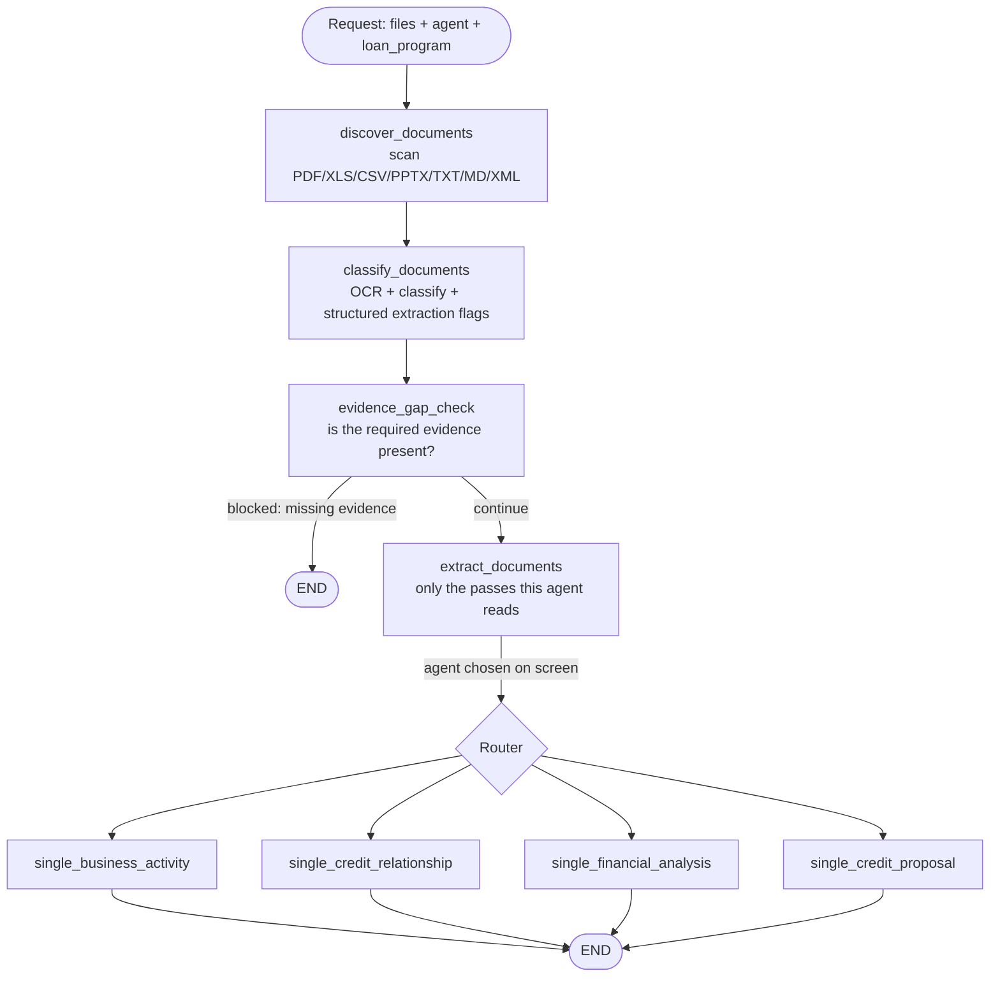

# SME Credit Memo — Multi-Agent Underwriting

A **multi-agent** system for SME (small & medium enterprise) credit underwriting, built on
**LangGraph**. The upload screen supplies three things — the customer's files, which **flow** to
run, and which **loan program** the customer is applying under — and the pipeline does the rest:
OCR → document classification → evidence-gap check → structured extraction → one specialist
agent → a formatted Vietnamese report.

The entry point is the notebook [local_underwriting_agents.ipynb](local_underwriting_agents.ipynb);
all agent logic lives in the importable package [src/](src/).

---

## Table of Contents

- [Key Features](#key-features)
- [Architecture Overview](#architecture-overview)
- [Agent Processing Workflow](#agent-processing-workflow) ⭐
- [Project Structure](#project-structure)
- [Installation](#installation)
- [Configuration (.env)](#configuration-env)
- [Running It](#running-it)
- [Outputs](#outputs)

---

## Key Features

- **Deterministic pipeline** via LangGraph: every step is a node, and no LLM decides which step
  runs next. The one branch in the graph is driven by the agent the user picked on screen.
- **In-house OCR**: PDF → text using `pypdfium2` + Tesseract, with image preprocessing and caching.
- **Document classification from the upload box down**: each of the six upload folders narrows the
  candidate types before any keyword scoring happens, and an LLM is consulted only when the
  keyword pass is genuinely unsure.
- **4 specialist agents**, one per flow. Exactly one runs per request.
- **Deterministic figures**: financial ratios (`FinancialRatioCalculator`) and the credit need
  (`credit_need_calculator`) are computed in code and handed to the agent as data, not left for
  the LLM to derive.
- **Structured extraction gated by route**: five extraction passes exist; only the ones the chosen
  agent actually reads are run, so a business-activity run costs a fraction of a proposal run.
- **Evidence-gap check before spend**: a run missing its required documents stops and names them,
  before a single extraction or analysis call is made.

---

## Architecture Overview

| Module | Role |
|---|---|
| [src/agents/supervisor.py](src/agents/supervisor.py) | **Orchestrator** — builds and runs the LangGraph, prepares documents, gates extraction, finalizes the report |
| [src/agents/documents/](src/agents/documents/) | File discovery (`document_discovery.py`) and keyword classification (`document_classification.py`) |
| [src/agents/documents/document_matrix.py](src/agents/documents/document_matrix.py) | Loads `document_matrix.yaml` — which agents consume which document type, per loan program |
| [src/agents/specialist.py](src/agents/specialist.py) | The four specialist agents |
| [src/agents/prompt_blocks.py](src/agents/prompt_blocks.py) | Turns extracted JSON + computed figures into the labelled blocks an agent's prompt carries |
| [src/agents/calculator/](src/agents/calculator/) | Deterministic financial ratios and credit-need computation |
| [src/agents/extraction/](src/agents/extraction/) | The five structured-extraction passes (BCTC, proposal, CIC S10A, CIC R21, site visit) + VAT revenue parsing |
| [src/config.py](src/config.py) | LLM client factory + runtime `Config` |
| [src/types.py](src/types.py) | Shared types (`AgentName`, `WorkflowMode`, `ClassifiedDocument`, `UnderwritingGraphState`…) |
| [src/utils/reading/](src/utils/reading/) | OCR, PDF/CSV/XLSX extraction, tax-XML parsing |
| [src/utils/report/](src/utils/report/) | Citations, money formatting (đồng → tỷ VNĐ), markdown repair, template-leak checks, and `visualization/` for charts, diagrams, HTML/PDF rendering |
| [src/templates/](src/templates/) | Per-agent output structure + guidance Markdown |

---

## Agent Processing Workflow

### LangGraph diagram

Every request flows through one deterministic `StateGraph` of **8 nodes**. The state passed
between nodes is `UnderwritingGraphState`.



There is **no routing LLM**. `process()` takes the agent id directly, `_decision_for()` maps it to
its workflow mode, and an id the system does not define raises immediately rather than silently
falling back.

### Stage 1 — Discovery & classification

**1. `discover_documents`** — Recursively scans the paths in `INPUT_PATHS` for files with valid
extensions: `.pdf .xlsx .xls .csv .pptx .txt .md .xml` (capped by `max_files`, default 50). Files with an
unsupported extension are **named in a warning** rather than dropped in silence — a folder of
twelve XML tax returns once produced a report built on nothing at all, with no line saying so.
Duplicates are removed by path, then by content hash.

Spreadsheet rows that repeat are **de-duplicated before the 500-row cap**, keeping the first
occurrence of each distinct row. Pasting a block down a sheet is a common habit — one upload
arrived with the same two columns repeated past a million rows, and 498 of the 500 rows that
reached the prompt were copies of the other two. De-duplication runs *before* the cap, not
after: a file whose pasted block sits ahead of the real data would otherwise spend the whole
window on copies and drop every real row behind them. The count is named in the sheet header
(`đã bỏ N dòng trùng lặp`) rather than trimmed in silence — that line is also the only thing
that would surface the rare case where two genuinely identical detail rows exist.

A file under **none of the six upload boxes is dropped**, named in a warning of its own. The screen
files every upload into a box, so a loose file did not come from the screen — it is an integration
fault, and classifying it would launder that fault into a report. The drop happens here rather than
in the classify loop because OCR runs there: discarded before `extract_document_text` costs nothing,
discarded after has already been paid for. When this empties the dossier the run stops and says so
directly — *"hồ sơ chưa được gắn hộp upload"*, not "missing financial statements", which would send
the officer hunting for a document they already uploaded.

**2. `classify_documents`** — For each file:

- **Upload box** — the folder a file sits in *is* its group. The screen creates six folders and
  the user drops files into them, so `ho_so_tai_chinh/BCTC_2025.pdf` declares its own group with no
  guessing involved. Every ancestor is checked, not just the parent, so `ho_so_tai_chinh/2025/BCTC.pdf`
  keeps its box.

  The box is trusted, so a file dropped in the wrong one cannot be corrected — the type that would
  have won is never scored. The file is therefore **also scored against all 22 types, on its body as
  well as its name**, purely to report the disagreement; the label is left alone, because only the
  person who uploaded it knows which of the two they meant. Body text matters here: with a balance
  sheet's text filed under `ho_so_phap_ly`, `BCTC_VVS_2024.pdf` disagreed on its name alone, but
  `scan001.pdf` was labelled `giay_dang_ky_kinh_doanh` at 0.72 confidence with nothing said — and a
  scanner's default filename is the normal case, not the edge one. Warned only when the winning score
  clears `FILENAME_KEYWORD_WEIGHT`, the same floor the classifier uses to distrust its own answer.

  | Folder | Group | Types |
  |---|---|---|
  | `ho_so_phap_ly` | Hồ sơ pháp lý | 4 |
  | `ho_so_tai_chinh` | Hồ sơ tài chính | 7 |
  | `ho_so_vay_von` | Hồ sơ vay vốn | 4 |
  | `ho_so_tai_san_dam_bao` | Hồ sơ tài sản đảm bảo | 2 |
  | `ho_so_noi_bo` | Hồ sơ nội bộ | 3 |
  | `ho_so_soan_thao_noi_bo` | Hồ sơ soạn thảo nội bộ | 2 |

- **Text extraction** — PDF → OCR (`pypdfium2` renders pages → image preprocessing → Tesseract,
  cached by file hash); XLSX/CSV → tabular read via pandas; XML → tax-return parsing.

- **Classification** — identifies *which of the 22 `document_type` rows* in the routing matrix
  (`src/agents/documents/document_matrix.yaml`) the file is, by scoring that type's keywords against the
  filename and body (a filename hit counts triple — a well-named file states its own type).
  Knowing the upload box restricts the candidates to that group first. If confidence clears the
  threshold (0.65, `document_classifier_grouped_confidence_threshold` when the box is known,
  `document_classifier_rule_confidence_threshold` when it is not) the keyword result is used as-is;
  otherwise it **falls back to an LLM** classifier picking from the same catalogue.

  Two conditions keep the keyword result even below the threshold, because in both the LLM could
  not change anything that matters:
  - every plausible type feeds the same agents — the label would change, the routing would not;
  - the filename names **exactly one** type and the body did not overturn it. Confidence is a
    margin measure, so a clearly-named statement whose text quotes a neighbouring type's
    vocabulary (a BCTC naming the balance sheet inside itself) can dip under the threshold with
    nothing genuinely in doubt.

  If the LLM returns a type id the matrix does not define, the keyword result is kept — an unknown
  id would route the document nowhere.

- **Routing** — the matrix maps that type to the agents that consume it, each marked `R` (required
  evidence) or `O` (optional). One document routinely feeds several agents. `R` documents get the
  larger share of an agent's character budget.

- A document matching no type falls back to `GENERAL_CONTEXT` and is shared with every agent, so a
  classification miss never hides evidence.

**Loan program.** The matrix holds an `R`/`O` level per agent **per loan program** (`B1CP`, `MISA`,
`PLPP`, `PLO`). The user picks it on the upload screen and it arrives as the `loan_program`
argument; empty falls back to `DEFAULT_LOAN_PROGRAM` (**PLO**) and an unknown id raises. Nothing is
detected or inferred. The program actually applied is reported in `result["loan_program"]`.

**Editing the routing matrix**: `src/agents/documents/document_matrix.yaml` is the single source of truth
(transcribed from `docs/document_matrix.xlsx`). Changing which agents see a kind of document is a
YAML edit, not a code change. It is validated on load — an unknown agent name, a bad `R`/`O` value,
or a per-loan-program map missing one of the four programs raises immediately.

### Stage 2 — Evidence gap check

`evidence_gap_check` asks whether there is enough evidence for the chosen agent to answer, and
builds an execution plan. It works two ways at once:

- **By agent bucket** — a document counts toward *every* agent it is real evidence for, not just
  its primary label, so "missing evidence" does not fire for coverage that is genuinely present in
  a combined document. `FINANCIAL_ANALYSIS_AGENT` without financial documents is a `high` gap that
  cannot continue; `BUSINESS_ACTIVITY_AGENT` without business documents is `medium`.
- **By upload box** — the matrix knows which types are `R` for this agent under this loan program,
  so the response can name **the specific documents that are absent**, which the bucket check
  alone cannot do.

If the run cannot continue, it stops here with a Vietnamese response listing what is missing —
before any extraction or analysis call is paid for.

### Stage 3 — Structured extraction

`extract_documents` runs the passes that turn raw OCR into JSON the agent reads as data instead of
prose. Each pass costs **one LLM call per matching document**, so only the passes the chosen agent
consumes are run:

| Agent | Passes run |
|---|---|
| `BUSINESS_ACTIVITY_AGENT` | site visit, ledger |
| `FINANCIAL_ANALYSIS_AGENT` | BCTC, site visit, ledger |
| `CREDIT_RELATIONSHIP_AGENT` | CIC S10A, CIC R21, site visit, ledger |
| `CREDIT_PROPOSAL_AGENT` | BCTC, CIC S10A, proposal, site visit |

The six passes are declared **once**, as the `EXTRACTION_PASSES` table in
[supervisor.py](src/agents/supervisor.py). One row carries a pass's label, its per-document flags,
its chain, its extractor, the prompt block it produces and the agents that read it — so which
agents read which block cannot drift from the gate that decides whether to run it.

The **ledger** pass is the odd one out twice over. It is `batch=True`, so however many detail
ledgers a dossier holds it costs exactly **one** call, not one per file — the same account can
arrive split across two files, and a single call sees the whole set. And its input is not a scan:
`extract_excel_text` has already split the workbook by sheet and kept the `.xlsx` number formats,
so the pass feeds that text back and asks for the finished record, **figures included**.

The pass reads the workbook itself through `read_sheets`, which is the same reader
`extract_excel_text` uses — one source, two shapes. It sends a JSON array of
`{filename, sheet_name, content}`, one object per sheet, rather than fenced text: splitting
the text form back apart with a regex would break the moment a sheet name contains a dash
or the header line gains a field, which it did.

Sheet names are decoded from their abbreviations — `P.TRA KHAC` is phải trả khác and lands
on 338, `NXT` is nhập xuất tồn — and `unknown` is reserved for a sheet whose *subject* is
unreadable, never for one whose columns are laid out unusually. Inventory is the one
category that splits by what is being counted: vehicles held for resale give 156, raw
materials 152, tools 153, finished goods 155.

Two traps around the printed total row cost a whole run each. It is often printed **above**
the details rather than below, and a detail row can carry the **same figure** as the total
when one counterparty holds nearly the whole balance — so the total row is identified by its
label and never by its amount. Dropping that row silently loses the largest position in the
account.

Each account names both the files and the **sheets** it came from — `source_files` and
`source_sheet_name` — because one entry can merge several sheets of the same account and
period, and a dossier of one-account-per-file workbooks otherwise gives no way to tell which
tab a figure was read off.

**The same shape now carries the financial statements.** Measured on a real dossier, the
FA user prompt was 26,716 tokens, of which `[EXTRACTED FINANCIAL STATEMENTS]` alone was
17,591 — more than everything else combined. Its `line_items` repeated `label`/`code`/
`values`/`page` on all 108 rows of each filing, so they became positional arrays under an
`item_columns` that names the periods once. Rows whose every period is empty are group
headings, not data — a cash-flow statement carried 11 of them — and `drop_heading_rows`
removes them because the prompt asking for it is a request, not a guarantee.
`notes_summary` went too, at 2,182 tokens per file.

That last one is a real loss, recorded here so the reason survives: it was the only
evidence behind §2.2.1d/e and §2.2.2e — pledged assets, items over 10% of the balance
sheet, related-party dealings. A recent report wrote "thuyết minh nêu tiền gửi thế chấp
đảm bảo khoản vay 1.148,20 tỷ VNĐ"; that sentence can no longer be written. It was
dropped knowingly.

Two other cuts came from the same measurement. The metrics block printed a list of 21
formulas immediately above a table whose "Công thức" column holds the same 21, word for
word. And the ledger block restated the `sorted_by`-to-section lookup and the `totals`
denominator rule that both guidance files already carry — the block prints once per
ledger document, the guidance once per run. Rules tied to a **report section** now live
only in the guidance; the block prose says only what the JSON keys mean. Together:
**26,716 → 16,904 tokens, 37% off.**

Detail rows are **positional arrays** under a per-account `item_columns`, not objects
repeating their field names on every row. Names cost 56% of what `items` weighs and `items`
is 64% of the record, so the shape change pays twice: the model writes 41% fewer tokens, and
the rendered block drops 55% — which matters more than the saving, because that block is
capped at 40,000 characters and a 342-row dossier used to reach the agent with only 102 of
its rows. It now arrives whole, and the ceiling holds 384 rows instead of 114.

`items` is also no longer every row, and it is no longer one list. The report lists **at
most five** counterparties or stock items per section, so everything past the fifth was paid
for and never read. But the sections do not agree on what "largest" means, and one account is
asked for under several of them at once — TK 131 by movement for turnover, by closing debit
for the receivable ageing, by closing credit for customer prepayments.

The first attempt asked for the **union** of those top fives as a single list. A live run
showed why that fails: computing a union of three rankings is several steps of arithmetic
done in the head, and nothing in the answer lets a checker see whether it came out right.
Every account with more than five rows came back with exactly five, and TK 341 dropped the
lender ranked 2nd by movement and 4th by balance while keeping one that led no ranking at
all — while the guard, which only counted rows, stayed silent.

So an account now carries **one ranked list per criterion**, in `rankings`, each labelled
with the `sorted_by` column it was ordered by. The model's task per list is a single step —
sort by this column, take five — and both the order and the count are checkable from the
answer itself. A counterparty leading two rankings appears in both, with the same figures;
each report section reads the one list built for it (`TOP_ROW_CRITERIA`, traced line by line
to the guidance templates, and rendered into the prompt from that same dict).

The criteria table also shrank. Nothing enumerates rows of TK 341, 338 or 138 — FA 2.2.2c is
prose with no table, and 2.2.1e/2.2.2e take their figures from the balance sheet — so those
categories get one list by their closing balance instead of two or three. On the sample
dossier the two effects nearly cancel: 41 rows under the union shape, 46 under this one.

The union only works if the reader knows what it is holding, so `totals` came back into the
schema after two rounds of removing it. It was safe to drop while `items` was complete — the
program could just add the rows up. Against a slice, adding them up gives the balance of five
counterparties and calls it the account's, which is exactly the denominator the report divides
by to say "customer X is 40% of receivables". `totals` now covers the **whole** account, read
off the printed "Tổng cộng" row, and `item_count` counts the whole sheet.

That last part is a deliberate trade. `.xls` and `.csv` ledgers work now, where the previous
`openpyxl` reader could not open them at all — but no figure is guaranteed exact any more.
Measured on the sample workbook (338 comparable figures): `gpt-5.4-mini` got every figure right
in two runs of four, dropped a sheet with four wrong figures in a third, and returned an
unusable shape in the fourth. `gpt-4o-mini` is not usable for this pass — it returned one
closing balance of 82,036,126,740 as `0`. Four structural guards remain (truncated output, sheet count,
printed total row, misplaced top-level keys); none of them checks arithmetic.

The first of those exists because `JsonOutputParser` **repairs** a truncated reply rather
than raising: it closes the open braces and hands back a valid dict, so an answer cut off at
the token ceiling arrives looking complete. One live run returned 2 accounts out of 15
sheets that way, one of them declaring 26 rows and carrying 18. That used to be caught by
comparing `item_count` to `len(items)`; since the two differ by design now, the guard reads
what a set of single-criterion rankings still cannot do: skip a criterion the category calls
for, name a `sorted_by` that is not a real column, come back out of order by its own column,
give one counterparty different figures in two lists, return fewer than five rows from a
sheet that has five, or sum past `totals`. Three of those six only became checkable once
each list was cut down to one criterion. None of them catches a model that quietly picked the
wrong five and ordered them correctly — that would need the rows it never sent.
`LLM_MAX_TOKENS` now sets the ceiling explicitly — left unset, the gateway picks its own.

**The ceiling is per pass, because one number cannot fit the whole fleet.** Measured by
asking each model (`testing/probe_max_tokens.py` sends `max_tokens=999999` and reads the
figure back out of the 400): `gpt-4o-mini` allows 16,384 completion tokens, `gpt-5.4-mini`
128,000 — an eightfold spread inside one `.env`. A shared knob has to sit under the
weakest, which throttles the ledger pass by a factor of eight even though it runs on the
larger model. So `build_llm` takes `max_tokens_env` alongside `timeout_env`, and the ledger
pass reads `LLM_LEDGER_MAX_TOKENS`.

Sizing it is arithmetic, not guesswork. A detail row costs **68.7 tokens** on average
(58–80 depending on how long the counterparty name is), an account frame 298, the outer
frame 73. A 6-sheet, 340-row dossier therefore needs 21,600–29,100 — predicted 25,219 and
measured 24,638 on a real run, 2% out. 32,000 carries it with room; 16,000 would have cut
it at about row 206.

Going over the model's ceiling is a **400 that stops the run**, not a quiet trim, so the
value cannot simply be set high. `run_extraction` recognises that refusal and names the
variable to change.

The site-visit report is the one every specialist reads, because it is the only document
describing the business itself rather than one facet of it — industry and GSO code, main products,
who the customer buys from and sells to, and next year's revenue/COGS plan. Its `conclusion` block
is kept separate and labelled as the officer's **opinion**, not measured data, so agents do not
cite a judgement as though the file recorded a fact.

Deliberately placed **after** the gap check: a run blocked for missing evidence pays for no
extraction at all. Safe to defer because nothing before this point reads an extraction *result* —
the gap check works off the document types the matrix assigned. Skipped passes are named in the
step log with the calls they saved.

### Stage 4 — The specialist agent

The router sends the run to the single node matching the agent picked on screen. That agent
receives:

- the documents the matrix routed to it, trimmed to its character budget (`R` before `O`);
- the labelled prompt blocks built from the extraction JSON;
- **computed figures rather than raw numbers to work from** — financial ratios from
  `FinancialRatioCalculator`, the credit need from `credit_need_calculator`;
- its own output structure and guidance templates from [src/templates/](src/templates/).

| Agent | Responsibility |
|---|---|
| `BusinessActivityAnalysis` | Operations, core products/services, supply chain, sales outlook |
| `FinancialAnalysis` | Financial analysis, built on the pre-computed ratios |
| `CreditRelationshipAnalysis` | Credit relationships and debt history, from CIC S10A/R21 |
| `CreditProposalAnalysis` | Facility, limit, tenor, collateral — built on the computed credit need |

### Stage 5 — Finalization (`_finalize`)

Applied to every branch before returning, in this order and for stated reasons:

- **Footnotes consolidated** into one list at the end, returning the audit — collapsing repeated
  labels first would hide two agents having claimed the same one.
- **Blank line before bullet lists** — a list glued to the line above renders as a bare `-`.
- **`tidy_numbers`** — `8,00%` → `8%`, a table cell holding only a zero → `-`.
- **VAT revenue block stripped** — an internal data channel between the credit-relationship agent
  and the chart builder, never meant for the reader.
- **Money formatting** — VNĐ figures converted to **tỷ VNĐ** for readability (display only).
- **Findings appended** — unresolved citations and template leakage are *reported*, because a rule
  written in a prompt is a request, not enforcement.
- **Debt/revenue chart** — a `linechart` block drawn by the pipeline from the extracted CIC S10A
  JSON (debt) and the credit-relationship agent's own transcription of the VAT returns (revenue),
  so no model retypes the figures. Inserted **only when `CREDIT_RELATIONSHIP_AGENT` actually ran**.
  It anchors under that agent's heading, falling back to the end of the report. Placed last, after
  every text rewriter, because this block is written by the pipeline and is not the rewriters'
  business.

---

## Project Structure

```
.
├── local_underwriting_agents.ipynb   # Entry point — driver notebook
├── src/
│   ├── config.py                     # LLM factory + Config
│   ├── types.py                      # Shared types
│   ├── agents/
│   │   ├── supervisor.py             # LangGraph orchestrator + EXTRACTION_PASSES
│   │   ├── specialist.py             # The four specialist agents
│   │   ├── prompt_blocks.py          # Extraction JSON -> labelled prompt blocks
│   │   ├── documents/                # discovery, keyword classification, routing matrix
│   │   │   ├── document_matrix.py    # Loads and validates the YAML
│   │   │   └── document_matrix.yaml  # 22 document types -> consuming agents, per program
│   │   ├── calculator/               # financial ratios, credit need
│   │   └── extraction/               # BCTC, proposal, CIC S10A, CIC R21, site visit, VAT
│   ├── utils/
│   │   ├── common.py, paths.py
│   │   ├── reading/                  # ocr.py, extractors.py, tax_xml.py
│   │   └── report/                   # citations, formatting, markdown_fixups,
│   │       └── visualization/        #   charts, diagrams, graph_svg, report_html/style
│   └── templates/                    # Per-agent structure + guidance Markdown
├── samples/<testcase>/               # Uploaded files, one folder per upload box (gitignored)
├── logs/                             # Run outputs (gitignored)
├── docs/                             # document_matrix.xlsx + reference documents
├── .env / .env.example
└── README.md
```

> There are **no `__init__.py` files** anywhere under `src/` — it is a namespace package, imported
> as `src.agents.supervisor` from the project root.

> **Note:** `samples/` (customer data) and `logs/` are excluded from git via
> [.gitignore](.gitignore). `.env` holds real API keys — **never commit it**.

---

## Installation

**System requirements:** Python 3.11+ and **Tesseract OCR** (to read scanned PDFs).

```bash
# macOS
brew install tesseract tesseract-lang

# Ubuntu/Debian
sudo apt-get install tesseract-ocr tesseract-ocr-vie
```

**Python packages:**

```bash
pip install -r requirements.txt
```

PDF export of the final report additionally needs **WeasyPrint** and its native libraries
(`brew install weasyprint` on macOS installs both).

### Notebook outputs — run this once per clone

```bash
nbstripout --install --attributes .gitattributes
```

Running the notebook against real files leaves the customer's document names and financial figures in
the notebook's output cells, and this repository is public. The `nbstripout` git filter removes
outputs from what gets **committed** while leaving them on screen in your editor, so nothing has to be
remembered before each commit.

`.gitattributes` is in the repository, but the filter itself lives in `.git/config`, which is not.
**Without running the command above, git silently commits the notebook unchanged** — the attribute
alone does nothing. Verify it took effect with:

```bash
git add local_underwriting_agents.ipynb
git show :local_underwriting_agents.ipynb | grep -c '"output_type"'   # must print 0
```

---

## Configuration (.env)

Copy `.env.example` → `.env` and fill in the values.

**Models** — three roles, each bound to its own variable. An unset one raises at startup naming
the variable, before any call is made:

```env
MODEL_DOCUMENT=gpt-4o-mini    # document classification (LLM fallback), temperature 0.5
MODEL_ANALYZER=gpt-4o-mini    # the specialist agents, temperature 0.1
MODEL_ECONOMY=gpt-4o-mini     # all five structured-extraction passes, temperature 0.0
```

**API & endpoint:**

```env
OPENAI_API_KEY=sk-...
OPENAI_API_BASE=https://api.openai.com/v1   # change to use a compatible endpoint
```

**Timeouts & retries:**

```env
LLM_TIMEOUT_SECONDS=60        # per request
LLM_CLIENT_MAX_RETRIES=3      # backs off on 429/5xx, honours Retry-After
```

**OCR** — all optional, defaults shown:

```env
TESSERACT_CMD=tesseract
OCR_LANG=vie+eng   OCR_DPI=300   OCR_PSM=6   OCR_OEM=3
OCR_CACHE_DIR=                # empty = no cache
OCR_TIMEOUT_SECONDS=          # per page
OCR_MAX_WORKERS=              # pages OCR'd at once; empty/0 = min(8, CPU count)
OCR_PREPROCESS=0  OCR_DESKEW=1  OCR_DENOISE=0  OCR_BINARIZE=0
OCR_LAYOUT=1      OCR_DELINE=1  OCR_UPSCALE=1.0
OCR_AUTO_ROTATE=0             # fix sideways scans; off by default, see below
```

**OCR is the slowest step in a run**, and pages are OCR'd concurrently because Tesseract works
out-of-process — a 43-page statement went from **96s to 22s** at 8 workers. Pages are rendered in
batches of `OCR_MAX_WORKERS` rather than all at once, which also keeps memory flat: a 300dpi page
is ~25 MB, so an 87-page file would otherwise hold ~2.1 GB.

`OCR_AUTO_ROTATE` is off because the detector's accuracy splits by angle, measured on the sample
set: every **90°** verdict was correct (4/4 — genuinely sideways pages), every **180°** verdict was
wrong (4/4 — upright pages flipped into unreadable noise). Off trades away the 90° repair to stop
the 180° damage. Turn it on for a document set that really is sideways; it costs about 2.2s per
43 pages now that pages run in parallel.

**Cost per run.** There is no rate limiter — the retry/back-off in the SDK is what stands between a
burst of extractions and a 429. A run costs one classification call per document the keyword pass
was unsure about, one extraction call per document per pass the chosen agent needs, and one
analysis call. **Naming documents clearly is the biggest lever**: a file called `BCTC_2024.pdf` or
`SO CHI TIET 331 - CONG NO PHAI TRA.xlsx` settles on the keyword pass, while `SO 331.xlsx` or
`scan001.pdf` matches nothing and costs a classification call every run. Dropping files into the
right upload folder has the same effect, for the same reason.

---

## Running It

1. Open [local_underwriting_agents.ipynb](local_underwriting_agents.ipynb).
2. **Cell 2** — sets up paths & `load_dotenv`. Prints `Project root`.
3. **Cell 3** — the three things the upload screen supplies:
   ```python
   TESTCASE_ID = "case_1"
   LOAN_PROGRAM = "PLO"                      # B1CP, MISA, PLPP, PLO; empty = PLO
   AGENT = "FINANCIAL_ANALYSIS_AGENT"        # or BUSINESS_ACTIVITY / CREDIT_RELATIONSHIP
                                             #    / CREDIT_PROPOSAL _AGENT
   INPUT_PATHS = [str(PROJECT_ROOT / "samples" / TESTCASE_ID)]
   ```
4. **Cell 4** — builds `Config` with the three LLM clients.
5. **Cells 5–7** — import types, document modules, agents.
6. **Cell 8** — builds `Supervisor(config)`, draws the graph, calls
   `supervisor.process(INPUT_PATHS, agent=AGENT, loan_program=LOAN_PROGRAM)`, prints the report,
   the step log and the per-document classification, and warns about any extraction that failed or
   any document that matched no type.
7. **Cell 9** — writes every artifact to `logs/<testcase>_<timestamp>/` and exports the PDF.

> If you change `.env`, re-run cell 2 (`load_dotenv(override=True)`) **and** cell 4 to rebuild the
> clients with the new values.

---

## Outputs

Each run creates a `logs/<testcase>_<timestamp>/` directory containing:

| File | Content |
|---|---|
| `final_response.md` | The final report, diagrams inlined |
| `final_response.pdf` | The same report rendered via WeasyPrint |
| `result.json` | Full state (response, agent, loan program, steps, plan, gaps…) |
| `agent_outputs.json` | Raw output of the agent that ran |
| `document_classifications.json` | Classification result per document |
| `document_selections.json` | Which documents each agent was given, and how much of each |
| `financial_metrics.json` | The computed ratios, as data |
| `credit_need.json` | The computed credit need, as data |
| `financial_statement_extraction.json` | BCTC extraction JSON, per document |
| `proposal_extraction.json` | Credit-application extraction JSON, per document |
| `cic_s10a_extraction.json` | CIC S10A extraction JSON, per document |
| `cic_r21_extraction.json` | CIC R21 extraction JSON, per document |
| `sitevisit_extraction.json` | Site-visit extraction JSON, per document |
