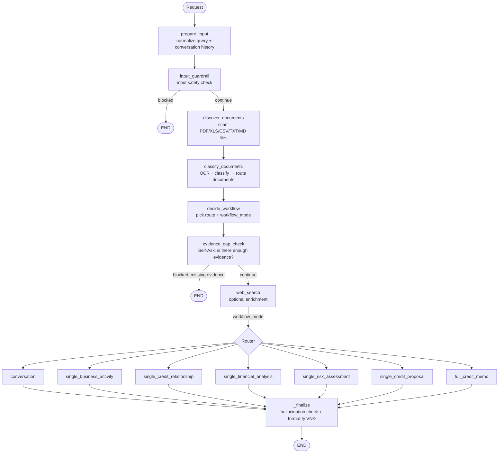

# SME Credit Memo — Multi-Agent Underwriting

A **multi-agent** system for SME (small & medium enterprise) credit underwriting, built on
**LangGraph**. It ingests customer files (financial statements, detailed ledgers, VAT
declarations, bank statements…), then automatically runs OCR → document classification →
specialist agents → and synthesizes a complete **Credit Memo**, with a hallucination check and
guardrails along the way.

The entry point is the notebook [local_underwriting_agents.ipynb](local_underwriting_agents.ipynb);
all agent logic lives in the importable package [src/](src/).

---

## Table of Contents

- [Key Features](#key-features)
- [Architecture Overview](#architecture-overview)
- [Agent Processing Workflow](#agent-processing-workflow) ⭐
- [Project Structure](#project-structure)
- [Installation](#installation)
- [Configuration (.env)](#configuration-env)
- [Running It](#running-it)
- [Outputs](#outputs)

---

## Key Features

- **Deterministic underwriting pipeline** via LangGraph: every step is a node, and routing is
  decided by explicit rules (the LLM is not free to jump between steps).
- **In-house OCR**: PDF → text using `pypdfium2` + Tesseract, with image preprocessing and caching.
- **Automatic document classification**: rule-based keyword scoring, falling back to an LLM when
  confidence is low — routes each document to the right agent.
- **5 specialist agents** + **1 composer** that assembles the credit memo.
- **Deterministic financial-ratio computation** (`FinancialRatioCalculator`) — figures are
  computed in code, not "made up" by the LLM.
- **Multi-layer guardrails**: input check, evidence-gap check, and a hallucination judge on the
  final output.
- **Web search enrichment** (optional, via Tavily) and **LangSmith tracing** (optional).
- **Per-role models**: each task type (decision, analysis, memo composition, hallucination…) is
  bound to its own model, configured via environment variables.

---

## Architecture Overview

| Module | Role |
|---|---|
| [src/agents/supervisor.py](src/agents/supervisor.py) | **Orchestrator** — builds and runs the LangGraph, decides route + workflow mode |
| [src/agents/document_classification.py](src/agents/document_classification.py) | Document discovery & classification (rule-based + LLM fallback) |
| [src/matrix/document_matrix.py](src/matrix/document_matrix.py) | Loads `document_matrix.yaml` — which agents consume which document type |
| [src/agents/specialist.py](src/agents/specialist.py) | The specialist agents + Credit Memo composer |
| [src/agents/financial_ratio_calculator.py](src/agents/financial_ratio_calculator.py) | Deterministic financial-ratio computation |
| [src/agents/guardrails.py](src/agents/guardrails.py) | Input guardrail, web search, hallucination judge |
| [src/config.py](src/config.py) | LLM client factory + runtime `Config` |
| [src/agents/tools.py](src/agents/tools.py) | Database tools (T24, CIC/bureau…) attached to specialist agents |
| [src/types.py](src/types.py) | Shared types (`AgentName`, `WorkflowMode`, `ClassifiedDocument`…) |
| [src/agents/tracing.py](src/agents/tracing.py) | Wraps the workflow in a single LangSmith run (optional) |
| [src/utils/](src/utils/) | OCR, document extraction, money formatting (đồng → tỷ VNĐ), notebook helpers |
| [src/templates/](src/templates/) | Markdown output templates for each specialist agent |

---

## Agent Processing Workflow

### LangGraph diagram

Every request flows through one deterministic `StateGraph`. The state passed between nodes is
`UnderwritingGraphState` (query, documents, decision, execution plan, output…).



### Stage 1 — Preprocessing & classification

**1. `prepare_input`** — Normalizes the user query and builds a compact conversation context from
`conversation_history`.

**2. `input_guardrail`** — When enabled (`RUN_SAFETY_GUARDRAILS=true`), `LocalGuardrails` calls an
LLM to classify the input as safe/unsafe. If **UNSAFE** → stop immediately with a blocking reply
(route `INPUT_GUARDRAILS`), avoiding the cost of downstream agents.

**3. `discover_documents`** — Recursively scans the paths in `INPUT_PATHS` for files with valid
extensions: `.pdf .xlsx .xls .csv .txt .md` (capped by `max_files`).

**4. `classify_documents`** — For each file:
- **Text extraction**: PDF → OCR (`pypdfium2` renders pages → image preprocessing → Tesseract,
  cached by file hash); XLSX/CSV → tabular read via pandas.
- **Classification**: identifies *what kind of document* it is — one of the 23 `document_type`
  rows in the routing matrix (`src/matrix/document_matrix.yaml`) — by scoring that type's
  keywords against the filename and body. If confidence ≥ threshold
  (`document_classifier_rule_confidence_threshold`, default **0.65**) it is used as-is;
  otherwise it **falls back to an LLM** classifier that picks from the same catalogue.
  The rule result is also kept when every plausible type feeds the same agents, since an
  LLM call could only change the label, not the routing.
- **Routing**: the matrix maps that type to the agents that consume it, each marked `R`
  (required evidence) or `O` (optional). One document routinely feeds several agents — a BCTC
  is evidence for both `FINANCIAL_ANALYSIS_AGENT` and `RISK_ASSESSMENT_AGENT`. `R` documents
  get the larger share of an agent's character budget.
- A document matching no type falls back to `GENERAL_CONTEXT` and is shared with every agent,
  so a classification miss never hides evidence.

**Loan program**: the matrix holds an `R`/`O` level per agent **per loan program** (`B1CP`, `MISA`,
`PL++`, `PLO`). Name the program anywhere in your request — *"Phân tích khách chương trình PLO"* —
and the matching column is used. Detection is exact string matching against the `aliases` declared in
the YAML, not an LLM guess. If no program is named, or two are named at once (*"so sánh B1CP với
PLO"*), the system falls back to the **strongest** level across all programs: that can only
over-prioritise a document, never demote real evidence. The outcome is always reported in
`result["loan_program_detection"]` and in the run's step log, so a missed or wrong detection is
visible rather than silent.

**Editing the routing matrix**: `src/matrix/document_matrix.yaml` is the single source of truth
(transcribed from `docs/document_matrix.xlsx`). Changing which agents see a kind of document is a
YAML edit, not a code change. It is validated on load — an unknown agent name, a bad `R`/`O`
value, or a per-loan-program map missing one of the four programs raises immediately.

### Stage 2 — Routing

**1. `decide_workflow`** — Based on the query, the classified documents, and the context, the
decision maker (LLM `MODEL_DECISION`) picks:
- **`route`** (`AgentName`) — the primary responding agent.
- **`workflow_mode`** (`WorkflowMode`) — the execution branch in the graph.

The 7 possible workflow modes:

| workflow_mode | Meaning |
|---|---|
| `conversation` | Plain Q&A, no specialist needed |
| `single_business_activity` | Business-activity analysis only |
| `single_credit_relationship` | Credit-relationship analysis only (T24/CIC) |
| `single_financial_analysis` | Financial analysis only |
| `single_risk_assessment` | Risk assessment only |
| `single_credit_proposal` | Credit-proposal calculation only (deterministic) |
| `full_credit_memo` | **Run the full pipeline → complete credit memo** |

**2. `evidence_gap_check`** — A **Self-Ask** analysis of whether there is enough evidence to
answer, and builds an **execution plan**. If required documents are missing
(`can_answer_now = false`) → it stops and returns a response spelling out what is missing (route
`EVIDENCE_GAP_CHECK`), avoiding expensive agent runs.

**3. `web_search`** — When enabled (`RUN_WEB_SEARCH=true`), `WebSearchProcessorAgent` (Tavily)
adds market/industry context. The router then branches by `workflow_mode`.

### Stage 3 — The `full_credit_memo` branch (full pipeline)

This is the highest-value branch. Execution order in
[_run_credit_memo_workflow](src/agents/supervisor.py):

```
        ┌──────────────────────── run IN PARALLEL (ThreadPoolExecutor) ─────────────────────┐
        │  BusinessActivityAnalysis  CreditRelationshipAnalysis  FinancialAnalysis           │
        │  (business ops)            (T24 + CIC/bureau)          (statements + ratios)       │
        │                         CreditProposalAnalysis                                     │
        │                         (facility, limit, tenor, collateral)                       │
        └───────────────────────────────────┬──────────────────────────────────────────────┘
                                             ▼
                          RISK_ASSESSMENT  (receives all 4 analyses)
                                             ▼
                    CREDIT_MEMO_COMPOSER  (synthesizes everything into the memo)
                                             ▼
                              _finalize → hallucination check → format tỷ VNĐ
```

1. **Four analysis agents run in parallel** — Business Activity, Credit Relationship, Financial
   Analysis and Credit Proposal each read the document set routed to them and are independent, so
   they run concurrently via `ThreadPoolExecutor` (max 4 workers, bounded by `LLM_MAX_CONCURRENCY`
   to respect the rate limit).
2. **Risk Assessment** — receives **all** prior outputs (the four analyses) to assess overall
   risk.
3. **Credit Memo Composer** — `CreditMemoComposerAgent` (LLM `MODEL_CREDIT_MEMO`) synthesizes
   everything into the final memo, capped by a character budget (`CREDIT_MEMO`, default 80k).

### Stage 4 — Finalization (`_finalize`)

Applied to **every** branch before returning the result:

- **Hallucination check** — when enabled (`RUN_HALLUCINATION_CHECK=true`),
  `HallucinationGuardrail` (LLM `MODEL_HALLUCINATION`, temperature 0) cross-checks the output
  against the document evidence and scores `hallucination_risk` and `final_action` (PASS / …).
- **Money formatting** — all VNĐ figures are converted to **billions of VNĐ (tỷ VNĐ)** for
  readability (display only).
- Returns the full state: `response`, `agent_name`, `steps`, `document_classifications`,
  `agent_outputs`, `hallucination_check`…

### The specialist agents

Each specialist is a subclass of `SpecialistAgent`
([specialist.py](src/agents/specialist.py)), built with `create_agent` (LangChain) and attached to:
- Its own **output template** (Markdown in [src/templates/](src/templates/)).
- Its own **database tools** by group ([tools.py](src/agents/tools.py)):
  `FINANCIAL_DATABASE_TOOLS`, `BUSINESS_ACTIVITY_DATABASE_TOOLS`,
  `CREDIT_RELATIONSHIP_DATABASE_TOOLS` (T24, CIC/bureau), `RISK_ASSESSMENT_DATABASE_TOOLS`.

| Agent | Responsibility |
|---|---|
| `BusinessActivityAnalysis` | Assess operations, core products/services, supply chain, sales outlook |
| `FinancialAnalysis` | Financial analysis; uses ratios from `FinancialRatioCalculator` |
| `CreditRelationshipAnalysis` | Credit relationships; queries T24 & CIC/bureau when customer identifiers are available |
| `RiskAssessment` | Aggregate risk assessment |
| `CreditMemoComposerAgent` | Composes the final credit memo |

---

## Project Structure

```
.
├── local_underwriting_agents.ipynb   # Entry point — driver notebook
├── src/
│   ├── config.py                     # LLM factory + Config
│   ├── types.py                      # Shared types
│   ├── agents/
│   │   ├── supervisor.py             # LangGraph orchestrator
│   │   ├── document_classification.py
│   │   ├── specialist.py
│   │   ├── financial_ratio_calculator.py
│   │   ├── guardrails.py
│   │   ├── tools.py                  # Database tools
│   │   └── tracing.py                # LangSmith tracing
│   ├── matrix/
│   │   ├── document_matrix.py        # Loads document_matrix.yaml
│   │   └── document_matrix.yaml      # Document type -> consuming agents
│   ├── utils/
│   │   ├── ocr.py                    # PDF → text (pypdfium2 + Tesseract)
│   │   ├── extractors.py             # PDF/CSV/XLSX
│   │   ├── formatting.py             # đồng → tỷ VNĐ
│   │   ├── paths.py, flow.py, common.py
│   └── templates/                    # Specialist output templates
├── testing/samples/                  # Sample files (NOT committed — gitignored)
├── logs/                             # Run outputs (gitignored)
├── docs/ARCHITECTURE.md
├── .env / .env.example
└── README.md
```

> **Note:** `testing/samples/` (customer data) and `logs/` are excluded from git via
> [.gitignore](.gitignore). `.env` holds real API keys — **never commit it**.

---

## Installation

**System requirements:** Python 3.11+ and **Tesseract OCR** (to read scanned PDFs).

```bash
# macOS
brew install tesseract tesseract-lang

# Ubuntu/Debian
sudo apt-get install tesseract-ocr tesseract-ocr-vie
```

**Python packages** (the main packages used in this project):

```bash
pip install langgraph langchain langchain-core langchain-openai \
            openai pandas pypdfium2 pytesseract opencv-python numpy pillow \
            python-dotenv nest-asyncio ipython pyyaml nbstripout
# Optional: langchain-tavily (web search), langsmith (tracing)
```

### Notebook outputs — run this once per clone

```bash
nbstripout --install --attributes .gitattributes
```

Running the notebook against real files leaves the customer's document names and financial figures in
the notebook's output cells, and this repository is public. The `nbstripout` git filter removes
outputs from what gets **committed** while leaving them on screen in your editor, so nothing has to be
remembered before each commit.

`.gitattributes` is in the repository, but the filter itself lives in `.git/config`, which is not.
**Without running the command above, git silently commits the notebook unchanged** — the attribute
alone does nothing. Verify it took effect with:

```bash
git add local_underwriting_agents.ipynb
git show :local_underwriting_agents.ipynb | grep -c '"output_type"'   # must print 0
```

---

## Configuration (.env)

Copy `.env.example` → `.env` and fill in the values. The main variable groups:

**Per-role models** (required — a missing one causes `you must provide a model parameter`):

```env
MODEL_DECISION=gpt-4o-mini        # route/workflow decision
MODEL_DOCUMENT=gpt-4o-mini        # document classification (LLM fallback)
MODEL_ANALYZER=gpt-4o-mini        # specialist agents
MODEL_CREDIT_MEMO=gpt-4o-mini     # memo composition
MODEL_HALLUCINATION=gpt-4o-mini   # hallucination judge / input guardrail
MODEL_ECONOMY=gpt-4o-mini         # conversation
```

**API & endpoint:**

```env
OPENAI_API_KEY=sk-...
OPENAI_API_BASE=https://api.openai.com/v1   # change to use a compatible endpoint
```

**Feature toggles** (off by default):

```env
RUN_SAFETY_GUARDRAILS=false   # input guardrail
RUN_HALLUCINATION_CHECK=false # hallucination judge on output
RUN_WEB_SEARCH=false          # Tavily enrichment (needs TAVILY_API_KEY)
```

**Performance & OCR:**

```env
LLM_REQUESTS_PER_MINUTE=9      # hard ceiling shared by every LLM client
LLM_CLIENT_MAX_RETRIES=3       # backs off on 429, honours Retry-After
LLM_MAX_CONCURRENCY=3          # specialists run in parallel in full_credit_memo
LLM_TIMEOUT_SECONDS=60
LLM_ANALYZE_TIMEOUT_SECONDS=...
OCR_LANG=vie+eng  OCR_DPI=...  OCR_PSM=...  OCR_CACHE_DIR=...
```

**Staying under a provider rate limit.** All seven LLM clients share **one**
`InMemoryRateLimiter` (`shared_rate_limiter()` in [src/config.py](src/config.py)), so
`LLM_REQUESTS_PER_MINUTE` is a whole-process ceiling rather than a per-client one. Bursting is
disabled (`max_bucket_size=1`), which is what makes exceeding the quota impossible instead of merely
unlikely: the four parallel specialists queue on the limiter rather than firing at once.

Set the value **below** your provider's real quota. One full credit memo run costs about **10 LLM
calls** — four parallel specialists, risk assessment, the memo composer, the hallucination judge, one
BCTC extraction per financial statement, and one per document the keyword pass was unsure about. At
9/minute that means a full run cannot finish in under a minute; that is the price of never seeing a
429. Every run reports its own numbers under `result["rate_limit"]` and in the step log, so a
throttled run can be told apart from a stuck one.

To go faster: raise the limit if your quota allows, set `RUN_HALLUCINATION_CHECK=false` (one call
less), name documents clearly so they resolve on the keyword pass instead of costing a
classification call, or run a single agent (about 3 calls) instead of the full memo.

**Tracing (optional):** `LANGSMITH_TRACING`, `LANGSMITH_API_KEY`, `LANGSMITH_PROJECT`.

---

## Running It

1. Open [local_underwriting_agents.ipynb](local_underwriting_agents.ipynb).
2. **Cell 2** — sets up paths & `load_dotenv`. Prints `Project root`.
3. **Cell 4** — configure the request:
   ```python
   QUERY = "Hãy phân tích tài chính cho khách hàng này"
   INPUT_PATHS = [str(PROJECT_ROOT / "testing" / "samples" / "case_1")]  # file or folder
   ```
4. Run the import cells in order (config → tools → classification → specialist → guardrails →
   supervisor).
5. **Final cell** — builds `Supervisor(config)`, draws the graph, calls `supervisor.process(...)`,
   and prints the memo.

> If you change `.env`, re-run cell 2 (`load_dotenv(override=True)`) **and** the cell that builds
> `config` to load the new values.

---

## Outputs

Each run creates a `logs/<testcase>_<timestamp>/` directory containing:

| File | Content |
|---|---|
| `final_response.md` | The final memo / answer |
| `result.json` | Full state (response, route, steps…) |
| `agent_outputs.json` | Raw output of each agent |
| `document_classifications.json` | Classification result per document |
| `hallucination_check.json` | Hallucination-check result |
