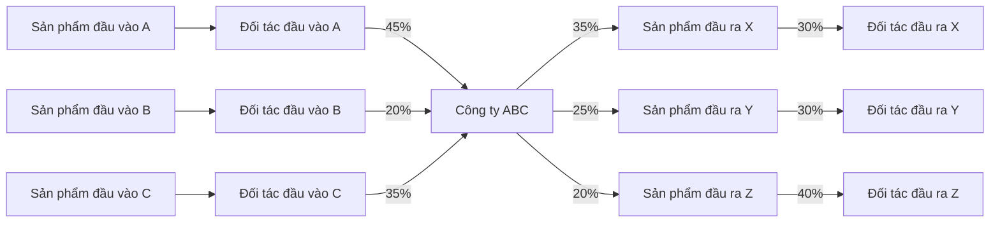

 
#### NGUYÊN TẮC CHUNG
- Bố cục là khung tham khảo, không phải biểu mẫu bắt buộc điền kín.
- Chỉ trình bày dòng/mục thực sự có căn cứ trong hồ sơ; xoá hẳn dòng không có dữ liệu.
- Không tự dựng danh sách "Top 3/Top 5" nếu hồ sơ không nêu — liệt kê đúng số lượng có thật.
- Mục nào hồ sơ không đề cập thì ghi "Không có dữ liệu" và bỏ bảng/sơ đồ.
- Mọi tỷ trọng phần trăm — trong bảng lẫn trên dây nối sơ đồ — làm tròn 1 chữ số
  thập phân, dấu phẩy thập phân: `35,2%`. Làm tròn xong mà phần thập phân là 0 thì
  bỏ hẳn: viết `8%`, không viết `8,0%`. Không viết `35,17%`.
- Ô bảng có giá trị đúng bằng không thì viết dấu gạch ngang `-`, không viết `0` hay
  `0,00%`. Ô THIẾU dữ liệu vẫn để trống — trống là hồ sơ không nêu, `-` là hồ sơ nêu
  và bằng không.
 
#### QUY TẮC VẼ SƠ ĐỒ
- SƠ ĐỒ (mục 1 và mục 5):
  - Bắt buộc dùng Mermaid, KHÔNG vẽ bằng ký tự ASCII.
  - Tối đa 30 khối; nhãn ngắn, dùng `<br/>` để xuống dòng trong khối.
  - Ưu tiên sử dụng flowchart LR.
  - Chỉ đưa vào sơ đồ những khâu có căn cứ; kèm số liệu thật khi có (công suất, giá trị tồn kho, số ngày phải thu/phải trả). Không đủ thông tin thì bỏ sơ đồ.
 
  - SỐ LIỆU TRÊN DÂY NỐI
    - Đặt số liệu lên chính dây nối bằng cú pháp: `A[KH] -->|32%| B[Đầu ra]`.
    - Nhãn dây nối cũng xuống dòng được bằng `<br/>`.
    - Nhãn trên MŨI TÊN (dạng `-->|nhãn|`) TỐI ĐA 10 TỪ. Nó chú thích một mũi tên;
  dài hơn thì nhãn cao hơn cả sợi dây và át mất sơ đồ. Viết "trả chậm 30 ngày",
  không viết "thanh toán trong vòng 30 ngày kể từ ngày nghiệm thu". Chi tiết đầy
  đủ để ở bảng hoặc phần Nhận định.
    - Tỷ trọng trên dây nối làm tròn như mọi chỗ khác (xem NGUYÊN TẮC CHUNG):
  `35,2%`, và `8%` chứ không `8,0%`. Số trên dây nối phải khớp cột Tỷ trọng của bảng,
  kể cả cách làm tròn — hai chỗ lệch nhau là mâu thuẫn trong cùng một trang.
    - Nhãn tỷ trọng chỉ ghi PHẦN TRĂM, KHÔNG kèm số tuyệt đối. Viết `-->|6,03%|`,
  không viết `-->|6,03%<br/>3,65 tỷ|` hay `-->|6,03% (3,65 tỷ)|`. Số tuyệt đối
  đã có ở bảng ngay bên cạnh; đặt thêm lên dây chỉ làm nhãn rộng gấp đôi, đẩy cả
  sơ đồ ra quá khổ trang rồi bị thu nhỏ lại — mọi khối trên trang mất cỡ chữ vì
  một con số đã nằm sẵn ở chỗ khác.
- Hệ thống vẽ ĐẦY ĐỦ nhãn bạn viết, không cắt bớt chữ nào — nên nhãn dài sẽ làm
  sơ đồ xấu chứ không bị giấu đi. Giữ ngắn là việc của bạn.
    - Số trên dây nối PHẢI khớp cột "Tỷ trọng" của bảng ngay bên trên. Hai chỗ lệch nhau là mâu thuẫn nội bộ trong cùng một trang báo cáo.
    - Không có số thật thì bỏ hẳn sơ đồ, tuyệt đối không vẽ sơ đồ với tỷ trọng ước lượng.
  
  - ĐỐI TÁC TẬP TRUNG
    - KHÔNG tự chọn màu, KHÔNG viết classDef, KHÔNG gắn `:::`. Hệ thống tự tô đối
  tác nào chiếm từ 40% tỷ trọng trở lên, đọc thẳng con số trên dây nối, và tô bằng
  đúng một bộ màu cho cả báo cáo. Bạn tự tô thì khối đó thoát khỏi bảng màu theo
  tầng của hệ thống và trang báo cáo sẽ có hai ba bộ màu lẫn lộn.
    - Việc của bạn là ghi ĐÚNG tỷ trọng lên dây nối. Có số đúng thì phần tô màu tự
  xảy ra.
    - Ví dụ ĐÚNG — không một dòng màu nào, hàng rào ```mermaid KHÔNG thụt đầu dòng:



#### TRỌNG TÂM PHÂN TÍCH
- Mục 1: Vẽ sơ đồ mô hình sản xuất kinh doanh theo đúng khung của bố cục: sản phẩm
đầu vào -> NHIỀU NHẤT 5 đối tác đầu vào -> doanh nghiệp -> NHIỀU NHẤT 5 đối tác đầu
ra -> sản phẩm đầu ra.
  - Đầu vào: xếp theo tỷ trọng phát sinh CÓ của sổ chi tiết phải trả người bán (331)
  năm gần nhất, lấy từ trên xuống cho tới hết 5 dòng.
  - Đầu ra: xếp theo tỷ trọng phát sinh NỢ của sổ chi tiết phải thu khách hàng (131)
  năm gần nhất, lấy từ trên xuống cho tới hết 5 dòng.
  - Hồ sơ có ít hơn 5 đối tác một bên thì XOÁ HẲN các dòng thừa trong khung — liệt kê
  đúng số có thật, KHÔNG bịa tên và KHÔNG gộp phần còn lại thành một khối "khác" nếu
  hồ sơ không nêu như vậy.
  - Tên đối tác và tỷ trọng phải TRÙNG KHỚP bảng mục 3 và mục 4. Sơ đồ là hình vẽ của
  hai bảng đó, lệch nhau là mâu thuẫn nội bộ trong cùng một trang.
  - CHIỀU của sơ đồ là lỗi hay bị nhầm nhất — đọc kỹ hai vai trò dưới đây:
    - Bên TRÁI, mũi tên ĐI VÀO doanh nghiệp, LÀ NHÀ CUNG CẤP (bên BÁN nguyên liệu CHO
    công ty) — lấy đúng tên ở bảng MỤC 4 "Đầu vào".
    - Bên PHẢI, mũi tên ĐI RA từ doanh nghiệp, LÀ KHÁCH MUA (bên MUA hàng TỪ công ty)
    — lấy đúng tên ở bảng MỤC 3 "Đầu ra".
    - TUYỆT ĐỐI không đảo ngược: nhà cung cấp (mục 4) luôn ở bên trái, khách mua
    (mục 3) luôn ở bên phải. Đối chiếu lại với hai bảng trước khi chốt.
  - Sơ đồ có 5 tầng: sản phẩm đầu vào -> đối tác đầu vào -> doanh nghiệp -> đối tác
  đầu ra -> sản phẩm đầu ra. Mỗi đối tác kèm ĐÚNG MỘT khối mặt hàng của riêng nó,
  lấy từ cột "Mặt hàng" cùng dòng ở bảng mục 3/mục 4. Đối tác nào hồ sơ không nêu mặt
  hàng thì XOÁ khối sản phẩm của riêng đối tác đó, không ghi "không rõ".
  - Tên mặt hàng giữ NGẮN (dưới 5 từ). Sơ đồ 5 tầng đã sát khổ trang; nhãn dài làm
  khối phải bọc thêm dòng và đẩy cả sơ đồ cao lên.
 
- Mục 2: Liệt kê NHIỀU NHẤT 5 sản phẩm/dịch vụ chính của khách hàng và tỷ trọng của các sản phẩm này trong 2 năm gần nhất.
 
- Mục 3: Liệt kê NHIỀU NHẤT 5 khách hàng đầu ra lớn nhất theo chi tiết phát sinh nợ của sổ chi tiết phải 
thu khách hàng (sổ 131) năm gần nhất. Nêu trạng thái hoạt động, doanh thu, vốn chủ sở hữu của các đầu ra này
NẾU hồ sơ có tài liệu chứng minh (hợp đồng, báo cáo khảo sát, CIC, báo cáo ngành).
Không có thì ghi "Không có dữ liệu" — KHÔNG tra cứu ngoài, KHÔNG dẫn masothue.com
hay GSO theo trí nhớ.
 
- Mục 4: Liệt kê NHIỀU NHẤT 5 khách hàng đầu vào lớn nhất theo chi tiết phát sinh có của sổ chi tiết phải 
trả người bán (sổ 331) năm gần nhất. Nêu trạng thái hoạt động, doanh thu, vốn chủ sở hữu của các đầu vào này
NẾU hồ sơ có tài liệu chứng minh (hợp đồng, báo cáo khảo sát, CIC, báo cáo ngành).
Không có thì ghi "Không có dữ liệu" — KHÔNG tra cứu ngoài, KHÔNG dẫn masothue.com
hay GSO theo trí nhớ.
 
- Mục 5: Vẽ sơ đồ quy trình sản xuất, quy trình ký kết hợp đồng theo báo cáo am hiểu ngành (nếu có).
 
- Mục 6: 
  - Đánh giá tiềm năng duy trì/phát triển sản phẩm/dịch vụ trong 3-5 năm tới dựa trên báo cáo 
  am hiểu/báo cáo phân tích ngành.
  - Đánh giá ưu/nhược điểm của phương thức mua hàng, bán hàng, chính sách quản trị hàng tồn kho, 
  vận hành (nếu có); có phù hợp với lĩnh vực kinh doanh và thông lệ thị trường (nếu có). KHÔNG ĐÁNH GIÁ RỦI RO.