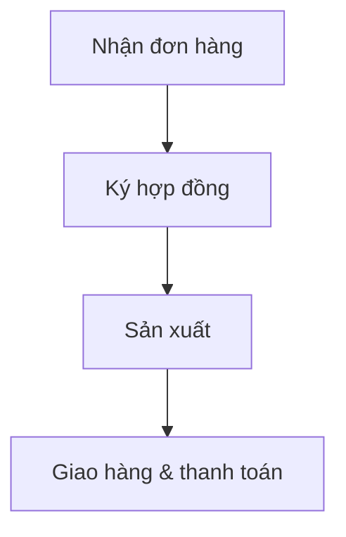

## Báo cáo phân tích hoạt động kinh doanh

### {{TenKhachHang}}

- **Mã số thuế**: {{MaSoThue}}
- **Số đăng ký kinh doanh**: {{SoDangKyKinhDoanh}}
- **Ngành nghề kinh doanh**: {{NganhNghe}}

### Nguồn thông tin

- **Hồ sơ**: {{DanhSachHoSo}}
- **Kỳ/Năm phân tích**: {{Ky}}
- **Mức độ tin cậy**: {{MucDoTinCay}}

---

## 1. Mô hình sản xuất kinh doanh

**Căn cứ**:

**Nhận định**:

## 2. Lĩnh vực kinh doanh và sản phẩm

| Lĩnh vực kinh doanh | Sản phẩm/Dịch vụ | Tỷ trọng doanh thu {{Nam-1}} | Tỷ trọng doanh thu {{Nam}} |
|---|---|---:|---:|

**Căn cứ**:

**Nhận định**:

## 3. Quy trình vận hành

**Căn cứ**:

**Nhận định**:

## 4. Đầu ra

| Đầu ra chính | Mặt hàng | Doanh số {{Nam}} | Tỷ trọng | Phương thức ký HĐ | Phương thức giao hàng | Phương thức thanh toán |
|---|---|---:|---:|---|---|---|

**Căn cứ**:

**Nhận định**:

## 5. Đầu vào

| Đầu vào chính | Mặt hàng | Doanh số {{Nam}} | Tỷ trọng | Phương thức ký HĐ | Phương thức giao hàng | Phương thức thanh toán |
|---|---|---:|---:|---|---|---|

**Căn cứ**:

**Nhận định**:

## 6. Kết luận

**Căn cứ**:

**Nhận định**:
